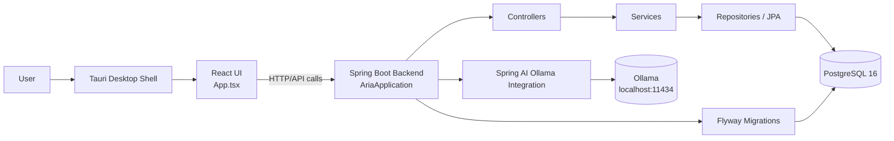

# Aria

Aria is a desktop-oriented application built as a monorepo with:

- a **Spring Boot** backend in `backend/`
- a **React + Vite + Tauri** frontend in `frontend/`
- **PostgreSQL** for persistence
- **Flyway** for database migrations
- **Ollama** for local AI model access through Spring AI

## Project overview

The backend exposes the application API, manages persistence, runs database migrations, and integrates with local AI services.

The frontend provides the user interface and is packaged with **Tauri** to run as a desktop app.

### Main backend entry point

- `backend/src/main/java/esssaw/aria/AriaApplication.java`

### Main frontend entry points

- `frontend/src/App.tsx`
- `frontend/src-tauri/src/lib.rs`

## Repository structure

```text
Aria/
├─ backend/      # Spring Boot API, persistence, migrations, AI integration
├─ frontend/     # React UI, Vite build, Tauri desktop shell
└─ README.md
```

## Prerequisites

Install the following before running the project locally:

- **Java 21**
- **Node.js 20+** and **npm**
- **Rust** toolchain for Tauri
- **PostgreSQL 16**
- **Ollama**

## Local development setup

### 1) Start PostgreSQL and Ollama

From the `backend/` directory, you can start the local services with Docker Compose:

```powershell
cd backend
docker compose up -d
```

This starts:

- PostgreSQL on `localhost:5432`
- Ollama on `localhost:11434`

Default database settings in `backend/src/main/resources/application.properties`:

- database: `aria`
- user: `postgres`
- password: `aria_local` by default, or `DB_PASSWORD` if set

### 2) Run the backend

From the `backend/` directory:

```powershell
cd backend
.\mvnw.cmd spring-boot:run
```

The backend runs on `http://localhost:8080`.

### 3) Run the frontend in development

From the `frontend/` directory:

```powershell
cd frontend
npm install
npm run dev
```

The Vite dev server runs at `http://localhost:5173`.

### 4) Build the frontend for Tauri

The current Tauri config expects the web build output at `frontend/build` (`frontendDist` is set to `../build`).

If you are using the default Vite output directory (`dist`), either:

- update `frontend/src-tauri/tauri.conf.json`, or
- set Vite to build into `build`

For a production build:

```powershell
cd frontend
npm run build
```

### 5) Run the Tauri desktop app

After the frontend build output matches the Tauri config, run:

```powershell
cd frontend
npx tauri dev
```

## Architecture



## Backend modules

- `controller/` - API endpoints
- `service/` - business logic
- `repository/` - database access with Spring Data JPA
- `domain/` - persistent domain entities
- `dto/` - request/response models
- `config/` - application configuration
- `scheduler/` - background jobs and scheduled tasks
- `ai/` - Ollama / AI-related integration code

## Notes

- The backend is configured to connect to PostgreSQL at `localhost:5432`.
- Flyway is enabled and validates schema changes on startup.
- Ollama is configured through `spring.ai.ollama.base-url=http://localhost:11434`.
- The frontend is still on the default starter screen; replace `frontend/src/App.tsx` as the application evolves.

## Helpful commands

```powershell
cd backend
.\mvnw.cmd test
```

```powershell
cd frontend
npm run lint
```


